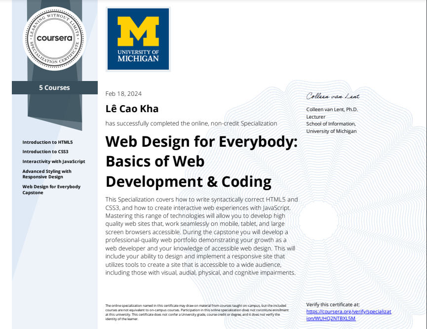

# 🎓 Certificates

## 🌟 Introduction

I am proud to showcase two significant certifications that reflect my commitment to continuous learning and professional development in web design and programming. The Web Design Certificate from Coursera, where I gained comprehensive knowledge about creating user-friendly and visually appealing websites. This certification has equipped me with the essential skills to build modern and responsive web applications.

## 1. Web Design Certificate from Coursera

## 📂 Why Share This?

I want to motivate myself and others on the path of lifelong learning. These certificates represent my commitment to acquiring new skills and applying them in real-world scenarios.

Thank you for visiting! Keep learning and growing. 💪
